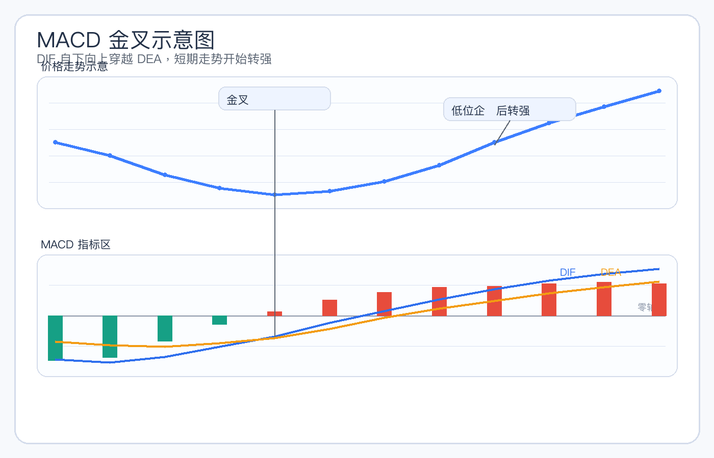
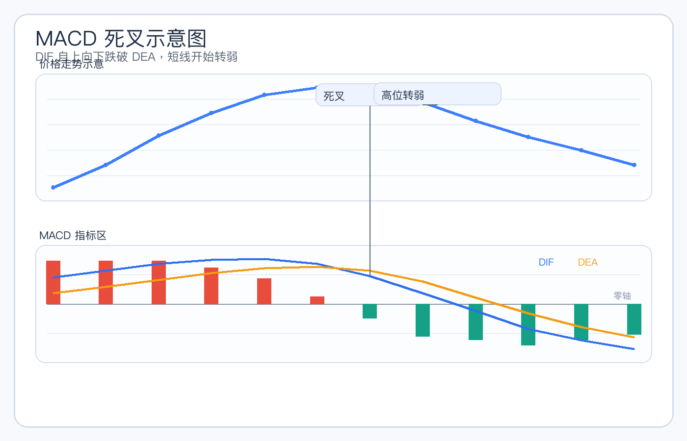
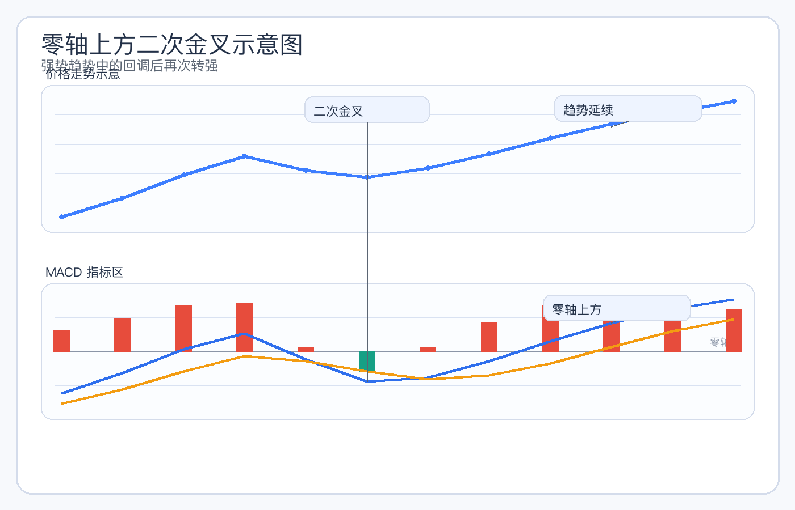
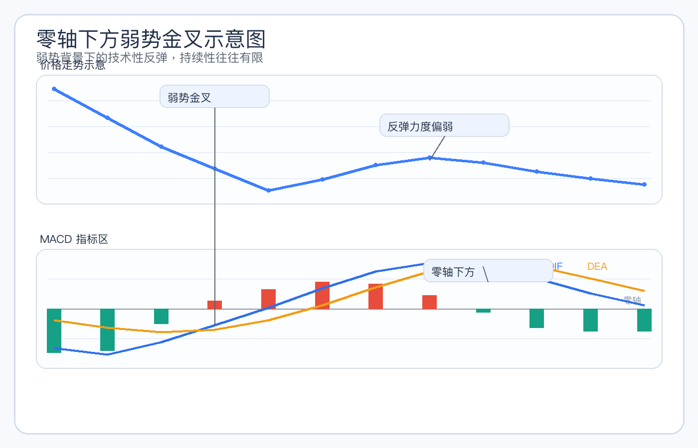
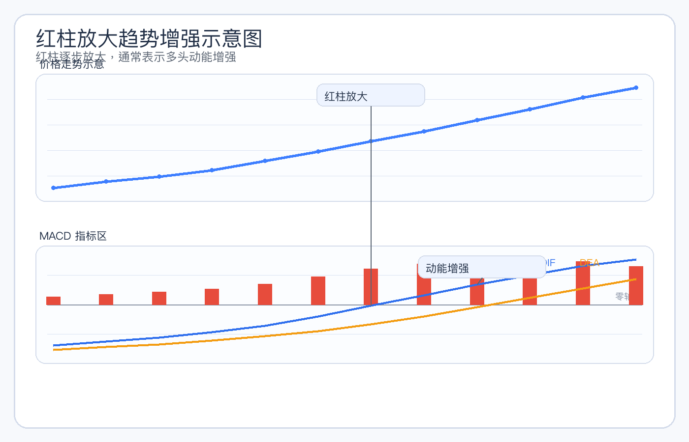
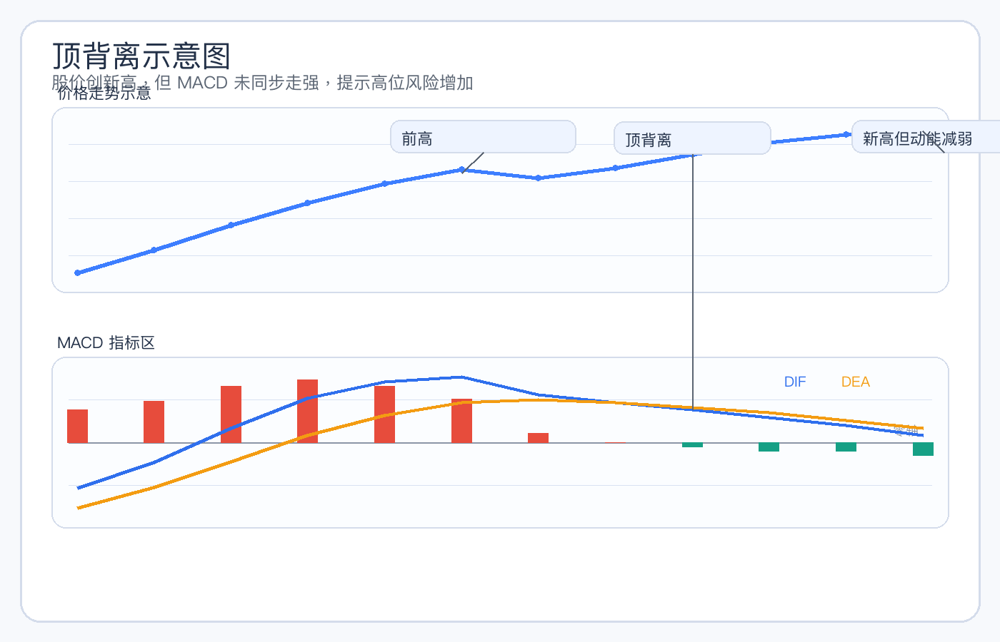
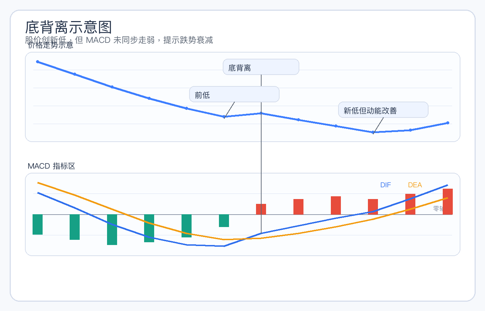
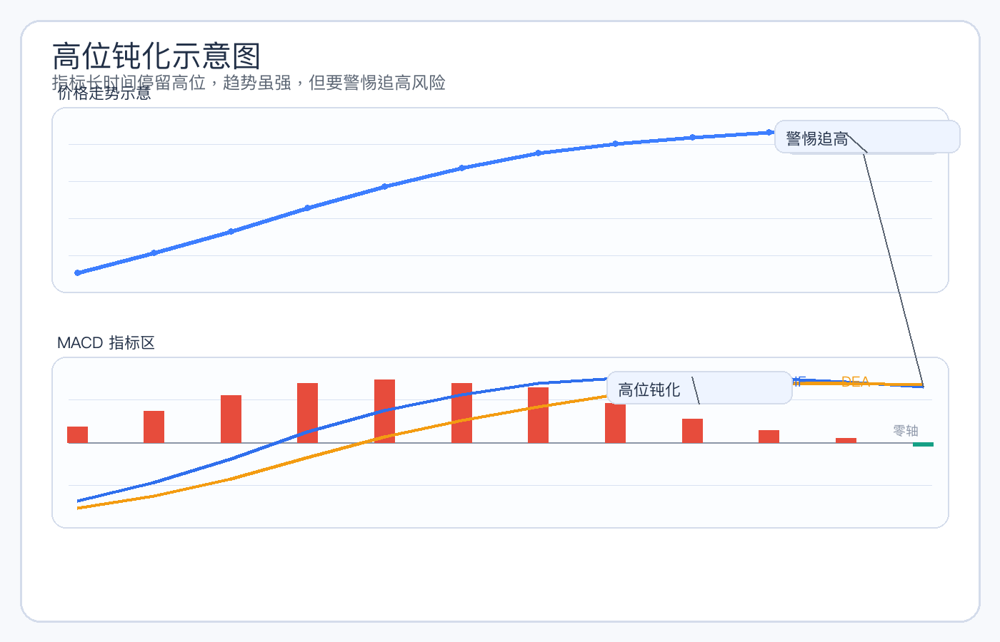

# MACD入门教程与实战详解

## 一、什么是 MACD

MACD 是股票技术分析中非常常见的一种趋势类指标，全称通常被称为“指数平滑异同移动平均线”。名字听起来比较复杂，但对普通投资者来说，可以先把它理解为：**用来观察趋势强弱、节奏变化以及多空力量转换的工具**。

很多初学者第一次接触 MACD 时，最先记住的往往是“金叉买、死叉卖”。这句话不能说完全错，但如果只把 MACD 理解成一个机械的买卖信号工具，就容易在实战中吃亏。因为 MACD 的真正价值，不在于单独给出一个绝对准确的买卖点，而在于帮助投资者理解：

- 当前趋势是在增强还是减弱
- 多头力量是在积累还是衰退
- 股价上涨或下跌，背后是否有趋势动能支持
- 目前看到的上涨，是主升行情，还是短暂反弹

MACD 之所以常用，是因为它比单纯看 K 线更容易看到“趋势的变化过程”。很多时候，股价表面上还没有走出特别明显的方向，但 MACD 已经开始出现强弱转变的迹象。

不过也要注意：**MACD 不是万能指标**。它更适合趋势行情，对于来回震荡、方向不清晰的市场，容易频繁发出干扰信号。因此，学习 MACD 的关键不是死记几个名词，而是理解它在不同位置、不同趋势阶段中的含义。

---

## 二、MACD 的组成

MACD 通常由三部分组成：

- DIF 线
- DEA 线
- MACD 柱状图

对初学者来说，不一定要强行背下复杂公式，但一定要知道这三部分分别代表什么。

### 1. DIF 线

DIF 可以理解为短期趋势和中期趋势之间的差值变化。它对股价变化反应更快，因此往往更灵敏。

当 DIF 向上运行时，通常说明短期走势正在变强；当 DIF 向下运行时，通常说明短期走势正在走弱。

你可以把它理解为：市场短期情绪是否正在变热，或者短线力量是否正在增强。

### 2. DEA 线

DEA 是对 DIF 的进一步平滑处理，因此它的波动通常会比 DIF 更慢一些，也更稳定一些。

如果说 DIF 更像“先动的情绪线”，那么 DEA 更像“相对稳一点的参考线”。很多人看 MACD 时，重点就是观察 DIF 与 DEA 的相互关系，因为这往往能反映短中期力量的变化。

### 3. MACD 柱状图

柱状图反映的是 DIF 与 DEA 之间的差距大小。很多交易软件中，红柱和绿柱会随着这两条线的变化而放大或缩短。

一般可以这样理解：

- 红柱逐渐变长，说明多头动能在增强
- 红柱逐渐变短，说明上涨动能在减弱
- 绿柱逐渐变长，说明空头动能在增强
- 绿柱逐渐变短，说明下跌动能在减弱

很多时候，柱状图的变化会比“金叉死叉”更早透露一些节奏上的变化，因此它在实战里很有参考意义。

### 4. 初学者如何快速理解

如果你觉得这几个概念一开始有点抽象，可以先这样记：

- DIF：变化快，反映短期强弱
- DEA：变化慢，反映相对稳定的趋势判断
- 柱状图：反映多空动能是在增强还是减弱

这样理解以后，再去看图，MACD 就不会只是几根线，而是一个帮助你观察趋势和动能的工具。

---

## 三、MACD 的核心逻辑

MACD 的核心，不是“看到金叉就买”，而是看**趋势变化是否正在发生，以及这种变化有没有持续性**。

### 1. 为什么 MACD 能反映趋势变化

股价在上涨过程中，短期价格通常会比中期价格更强；而在下跌过程中，短期价格通常会比中期价格更弱。MACD 本质上就是通过这种短中期变化的差异，去观察市场强弱的变化。

所以，当 MACD 逐渐走强时，往往说明上涨动能正在积累；当 MACD 逐渐走弱时，往往说明下跌压力或调整需求正在增强。

### 2. 为什么柱状图很重要

很多人只盯着金叉死叉，却忽略了柱状图。实际上，柱状图经常能帮助你更早察觉趋势节奏变化。

例如：

- 股价还在涨，但红柱开始缩短，说明上涨动能在减弱
- 股价还在跌，但绿柱开始缩短，说明下跌动能在衰减

这并不代表股价马上就会反转，但至少说明原来的趋势力量没有之前那么强了。

### 3. MACD 更适合趋势行情

MACD 是一个趋势类指标，所以在单边上涨或单边下跌中，参考价值通常更高。

比如在一轮明确上升趋势里：
- 回调时 MACD 没有明显走坏，往往说明趋势还在
- 再次转强时，MACD 往往能提供较好的辅助确认

但如果市场本身就是来回震荡、没有明确方向，那么 MACD 的金叉死叉可能会频繁出现，信号质量也会明显下降。

### 4. MACD 的本质是“辅助理解”，不是“替代判断”

很多新手最容易犯的错误，就是把 MACD 当成自动买卖按钮。其实任何技术指标，最终都只是辅助工具。

真正有价值的用法是：

- 结合股价位置看信号
- 结合趋势方向看信号
- 结合成交量和均线判断信号是否可靠

也就是说，MACD 不是让你少思考，而是帮助你更系统地思考。

---

## 四、经典 MACD 信号详解

### 1. 金叉

金叉是指 DIF 从下方向上穿越 DEA。

#### 市场含义
- 短期走势开始转强
- 多头力量可能正在增强
- 市场情绪较之前有所改善

#### 关键观察点
- 金叉出现的位置很重要
- 低位金叉通常比高位金叉更有参考意义
- 如果金叉同时伴随成交量放大、均线走强，信号质量会更高

#### 风险提醒
金叉不代表一定上涨。尤其是在震荡行情中，金叉可能只是短暂反抽，随后又重新走弱。

### 2. 死叉

死叉是指 DIF 从上方向下穿越 DEA。

#### 市场含义
- 短期走势开始转弱
- 多头动能下降
- 调整或下跌压力可能增加

#### 关键观察点
- 高位死叉通常更值得警惕
- 如果死叉同时伴随放量下跌，往往说明抛压较重
- 如果只是上涨途中的小死叉，要结合整体趋势判断

#### 风险提醒
死叉也不代表一定大跌。在强势上涨趋势中，有时死叉只是短暂修整，并不一定意味着大级别转弱。

### 3. 零轴上方与零轴下方

零轴是观察 MACD 强弱背景的重要参考。

#### 零轴上方
如果 DIF 和 DEA 主要运行在零轴上方，通常说明市场整体仍处在偏强格局中。此时出现的金叉，往往更容易被理解为上涨趋势中的再次走强。

#### 零轴下方
如果 DIF 和 DEA 长时间运行在零轴下方，通常说明市场整体偏弱。此时即使出现短期金叉，也常常只是弱势反弹，持续性未必强。

#### 风险提醒
零轴并不是绝对分界线，但它能帮助投资者判断当前信号是在强势背景下出现，还是在弱势背景下出现。

### 4. 红柱放大

红柱放大，通常说明多头动能正在增强。

#### 市场含义
- 上涨力量增强
- 趋势可能在延续
- 市场追涨意愿有所提升

#### 关键观察点
- 是否发生在突破之后
- 是否伴随价格稳步上行
- 是否有成交量支持

#### 风险提醒
如果股价已经高位大涨，红柱继续放大未必代表更安全，反而可能意味着情绪接近亢奋。

### 5. 红柱缩短

红柱缩短，说明上涨动能在减弱。

#### 市场含义
- 多头力量仍在，但边际走弱
- 上涨速度可能放缓
- 股价进入调整的概率上升

#### 风险提醒
红柱缩短不代表行情立刻结束，但说明不能再像前期那样盲目乐观。

### 6. 绿柱放大

绿柱放大，说明空头动能增强。

#### 市场含义
- 下跌压力加大
- 市场情绪趋于谨慎或悲观
- 空方暂时占优

#### 风险提醒
若绿柱在下跌初期快速放大，通常说明趋势偏弱；如果在连续大跌后仍放大，则要防止恐慌情绪继续释放。

### 7. 绿柱缩短

绿柱缩短，说明下跌动能正在衰减。

#### 市场含义
- 空头力量开始减弱
- 跌势可能趋缓
- 市场可能进入止跌观察期

#### 风险提醒
绿柱缩短不等于马上反转上涨，它更多只是说明“跌得没那么凶了”，还需要后续信号进一步确认。

### 8. 顶背离

顶背离是指股价创出新高或接近新高，但 MACD 没有同步走强，反而出现强度下降。

#### 市场含义
- 上涨动能不足
- 多头力量可能逐步衰减
- 高位风险开始增加

#### 关键观察点
- 是否发生在高位区域
- 是否伴随放量滞涨
- 是否随后出现死叉或跌破关键均线

#### 风险提醒
顶背离是警示信号，不是立即见顶的绝对证明。有时股价还会惯性冲高，但风险收益比通常已经不如前期。

### 9. 底背离

底背离是指股价创出新低或接近新低，但 MACD 没有同步走弱，反而出现改善迹象。

#### 市场含义
- 下跌动能减弱
- 空头力量可能接近尾声
- 阶段性止跌概率提升

#### 关键观察点
- 是否经历了较充分的下跌
- 是否出现成交量萎缩后再温和放量
- 是否随后出现低位金叉或趋势企稳

#### 风险提醒
底背离不等于马上大涨。很多股票即使出现底背离，也可能反复震荡筑底，不能因为一个背离就急于重仓抄底。

---

## 五、不同阶段的 MACD 特征

### 1. 底部区域

底部区域的 MACD 往往会出现以下特征：

- 绿柱逐步缩短
- DIF 和 DEA 在低位反复靠拢
- 偶尔出现低位金叉
- 背离信号开始增多

#### 如何理解
这通常说明下跌动能正在减弱，空头力量不像前期那样强，市场可能从“单边下跌”过渡到“震荡筑底”。

#### 注意事项
底部往往不是一天形成的，低位金叉也可能反复失败，所以更适合把它当成“观察信号”，而不是立刻满仓买入的理由。

### 2. 上升趋势

健康的上升趋势中，MACD 常常表现为：

- DIF、DEA 多数时间运行在零轴上方
- 红柱反复出现并维持较强
- 回调时红柱缩短或短暂翻绿，但很快恢复
- 再次金叉时，往往意味着趋势延续

#### 如何理解
这说明市场整体仍在强势节奏中，MACD 更多起到辅助确认趋势的作用。

#### 注意事项
在上升趋势里，不要因为一次小死叉就完全否定趋势，也不要因为一次金叉就盲目追高，还是要结合位置与涨幅判断。

### 3. 高位钝化

高位钝化是 MACD 实战中非常值得重视的现象。它通常表现为：

- 股价持续上涨
- MACD 长时间维持强势
- 红柱不一定明显继续放大，但指标长时间停留在高位

#### 如何理解
这说明趋势仍强，但也意味着市场已经运行较长时间，短线情绪可能较热，后续波动风险会增加。

#### 注意事项
高位钝化不是立刻见顶，但它往往提示投资者：继续追高要更谨慎，尤其要防止冲高回落或高位放量出货。

### 4. 下跌趋势

在持续下跌趋势中，MACD 常见表现是：

- DIF、DEA 多数时间运行在零轴下方
- 绿柱持续出现
- 反弹时偶有金叉，但力度不强
- 死叉之后容易继续走弱

#### 如何理解
这说明市场整体弱势，MACD 发出的短期转强信号，很多时候只是技术性反抽。

#### 注意事项
在下跌趋势中，最重要的不是盲目找最低点，而是先确认弱势格局是否真正改善。

### 5. 震荡行情

震荡行情是 MACD 最容易“失真”的阶段。

#### 常见特征
- 金叉死叉频繁切换
- 红柱绿柱变化很快
- DIF、DEA 常在零轴附近来回穿梭

#### 如何理解
说明市场没有形成清晰方向，多空反复拉扯，趋势类指标的有效性会明显下降。

#### 注意事项
这种阶段如果只根据 MACD 机械操作，很容易反复被打脸。因此更需要结合支撑压力、成交量和趋势位置一起判断。

---

## 六、MACD 的实战用法

### 1. 如何用 MACD 辅助判断买点

MACD 更适合做“辅助确认”，而不是独立决定买点。

相对更有参考意义的买点，通常具备以下特征：

- 股价经过一轮调整后逐渐企稳
- MACD 绿柱缩短，说明下跌动能减弱
- 随后出现低位金叉
- 如果同时伴随成交量回暖、均线走平或拐头，信号会更可靠

这种买法的核心不是“看到金叉就买”，而是“市场先有止跌和企稳迹象，再用 MACD 去辅助确认”。

### 2. 如何用 MACD 辅助判断卖点

MACD 对卖点的提示，很多时候体现在“强转弱”的过程上。

例如：

- 股价在高位涨幅已经不小
- MACD 红柱开始缩短
- 随后出现高位死叉
- 如果同时伴随放量滞涨、跌破均线，风险会明显增加

这类信号并不意味着必须一次性清仓，但至少提示你要开始重视风险，而不是继续盲目追高。

### 3. 如何判断是趋势延续还是反弹

这是 MACD 实战里最重要的问题之一。

如果是趋势延续，通常会看到：
- MACD 主要运行在零轴上方
- 回调时指标虽走弱，但没有明显破坏整体强势结构
- 再次金叉时，股价往往同步走强

如果只是弱势反弹，通常会看到：
- MACD 长时间处于零轴下方
- 金叉出现后，红柱不够有力
- 股价反弹幅度有限，很快又重新走弱

所以，判断一个信号是否可靠，关键不在于信号本身，而在于它所处的趋势背景。

### 4. 为什么不能只看一次金叉死叉就下结论

因为市场不是静止的。一次金叉可能只是超跌反弹，一次死叉也可能只是正常回踩。

真正成熟的用法应该是：

- 看信号出现的位置
- 看前期涨跌幅度
- 看成交量是否配合
- 看均线和趋势是否支持

如果这些因素彼此印证，MACD 的信号才更有实战价值。

---

## 七、MACD 与均线、成交量的配合

MACD 单独使用有局限，和其他常见工具结合起来，实战效果通常会更好。

### 1. MACD + 均线

均线更适合看趋势方向，MACD 更适合看趋势强弱变化。两者结合，往往比单独看一个更稳。

例如：

- 均线多头排列，说明整体趋势偏强
- 此时 MACD 在零轴上方再次金叉，通常比弱势环境里的金叉更值得重视

相反，如果均线已经明显空头排列，而 MACD 只是零轴下方短暂金叉，那么很多时候只是反弹，不一定是真正反转。

### 2. MACD + 成交量

成交量是验证 MACD 信号质量的重要工具。

比如：

- MACD 金叉时，如果股价同步放量上涨，说明市场认可度更高
- 如果只是缩量小反弹，即使出现金叉，持续性也可能较差

再比如：

- 高位 MACD 死叉时，如果同时放量下跌，往往更需要警惕
- 如果只是缩量回调，则有时只是正常整理

### 3. MACD + 趋势位置

同样一个 MACD 信号，出现在不同位置，意义差别很大。

- 低位金叉：更像止跌后的修复信号
- 中途金叉：更像上升趋势中的延续信号
- 高位金叉：有时反而要小心最后冲顶

- 低位死叉：未必有太大杀伤力
- 高位死叉：通常更值得重视

所以，真正决定信号质量的，往往不是“金叉还是死叉”，而是“它出现在什么位置、处在什么趋势背景里”。

---

## 八、常见误区与风险提醒

### 1. 金叉不一定都能涨

这是最常见的误区。很多人把金叉当成买入按钮，结果在震荡行情里被反复打脸。

原因很简单：震荡市里本来就没有明确趋势，指标自然容易来回发信号。因此，金叉只有放在趋势、位置和量能背景里看，才有意义。

### 2. 死叉不一定都要立刻清仓

在强势趋势里，死叉有时只是上涨途中的正常整理。如果一看到死叉就立刻全部卖出，可能会错过后续主升段。

关键要看：
- 是否处于高位
- 是否伴随放量转弱
- 是否跌破关键均线或趋势结构

### 3. 背离不等于马上反转

无论是顶背离还是底背离，本质上都只是“动能与价格不完全同步”的提醒。

它告诉你：原来的趋势没有那么顺了，但并不保证立刻反转。很多背离出现后，股价还会继续运行一段时间。

### 4. 高位钝化容易让人误判

高位钝化阶段看起来很强，容易让人产生“还能继续大涨”的冲动。但越是这种阶段，越要防止情绪过热后的冲高回落。

### 5. 震荡市里 MACD 信号质量较差

如果市场本身就没有方向，那么趋势类指标的参考价值自然下降。这时候若依赖 MACD 高频操作，往往容易频繁止损。

### 6. MACD 不能脱离其他因素单独使用

MACD 更像一个趋势观察器，而不是独立决策系统。真正实用的方式，是把它和以下因素一起看：

- 趋势方向
- 支撑压力
- 均线状态
- 成交量变化
- 个股所处位置

只有把这些因素放在一起，MACD 才能真正发挥作用。

---

## 九、总结

对初学者来说，学习 MACD 不需要一开始就背很多公式，重点是先建立正确理解。

可以把 MACD 简单记成一句话：**它不是专门告诉你买卖点的神奇按钮，而是帮助你观察趋势强弱和动能变化的工具。**

如果再进一步总结，MACD 最重要的几个使用原则是：

- 金叉死叉不能孤立看
- 零轴位置很重要
- 柱状图能帮助观察动能变化
- 背离是警示，不是命令
- 趋势行情更适合用 MACD
- 一定要结合均线、成交量和位置综合判断

真正成熟的投资者，不会把 MACD 当成万能公式，而是把它当成理解市场节奏的一部分。

当你能从“只会看金叉死叉”，进步到“会结合趋势、位置、量能去理解 MACD 的含义”，这个指标才算真正开始为你所用。

---

## 十、MACD各种情况的实例分析图

下面这一部分，主要是为 MACD 常见信号预留图文结合的案例分析位置。你后续只要把对应截图放进指定路径，就可以直接形成更完整的教学资料。

### 1. 金叉实例分析图

#### 图形解读
图中重点观察的是 DIF 自下而上穿越 DEA 的过程。如果这个金叉出现在股价经历调整之后、MACD 绿柱逐步缩短的阶段，那么它往往意味着短期走势开始转强。

#### 实战理解
更有参考价值的金叉，通常不是孤立出现的，而是同时伴随股价企稳、成交量回暖，或者均线开始走平回升。也就是说，金叉本身只是信号，真正重要的是它出现时的趋势背景。

#### 风险提醒
如果金叉出现在震荡行情中，或者出现在高位放量滞涨之后，那么它的持续性往往较差，不能机械理解为“出现金叉就一定上涨”。

### 2. 死叉实例分析图

#### 图形解读
这类图主要看 DIF 从上方向下跌破 DEA 的过程。如果死叉出现在一轮上涨之后，尤其是红柱缩短、股价涨速放缓的阶段，往往说明短线开始转弱。

#### 实战理解
死叉更适合作为风险升温的提醒，而不是绝对卖出命令。如果死叉同时伴随放量下跌、跌破关键均线或者前高压力附近滞涨，那么它的警示意义会更强。

#### 风险提醒
强势上涨趋势中的死叉，有时只是正常回调，不能因为一次小级别死叉就完全否定原有趋势。

### 3. 零轴上方二次金叉实例分析图

#### 图形解读
这一类图最重要的特点，是 DIF 和 DEA 已经运行在零轴上方，说明大趋势本来就偏强。随后在短期回调之后，MACD 再次形成金叉，这通常被看作趋势延续信号。

#### 实战理解
零轴上方二次金叉，往往比普通金叉更受重视，因为它出现时的市场背景更强。很多主升行情中，真正值得关注的不是底部第一次金叉，而是零轴上方回踩后的再次转强。

#### 风险提醒
即便如此，也要结合股价位置判断。如果股价已经短期大幅拉升，再出现二次金叉，也可能只是最后一段冲高。

### 4. 零轴下方弱势金叉实例分析图

#### 图形解读
这类图中，虽然出现了金叉，但 DIF 与 DEA 仍整体处于零轴下方，说明市场的大背景依旧偏弱。

#### 实战理解
这种金叉更多时候只能理解为超跌后的技术性反弹，而不是趋势反转确认。它有时能带来短线修复，但持续性通常不如零轴上方金叉。

#### 风险提醒
很多初学者容易把所有金叉都视为同等重要，这是常见误区。零轴下方的金叉必须降低预期，重点看后续能否真正站上零轴并形成趋势改善。

### 5. 红柱放大趋势增强实例分析图

#### 图形解读
这类图要重点看 MACD 红柱逐步放大的过程。红柱变长，通常说明多头动能正在增强，股价上涨趋势可能在延续。

#### 实战理解
如果红柱放大发生在突破平台、均线多头发散、成交量同步放大的阶段，那么往往说明市场对上涨的认可度较高，趋势延续概率更大。

#### 风险提醒
如果股价已经高位连续大涨，红柱继续放大未必意味着更安全，反而可能提示短线情绪过热，后面容易出现冲高回落。

### 6. 顶背离实例分析图

#### 图形解读
顶背离通常表现为股价继续创新高，或者接近新高，但 MACD 却没有同步创新高，反而显示出动能减弱。

#### 实战理解
这种图形反映的不是“股价一定马上下跌”，而是“上涨虽然还在继续，但推动行情的力量已经不像前期那么强”。它往往是高位风险逐步增加的重要提示。

#### 风险提醒
顶背离最怕和高位放量滞涨、死叉、跌破均线同时出现。一旦几个信号叠加，就不能再把它当成普通波动看待。

### 7. 底背离实例分析图

#### 图形解读
底背离通常表现为股价继续创新低，或者接近新低，但 MACD 没有同步走弱，反而出现低点抬高或绿柱缩短。

#### 实战理解
它说明下跌动能正在减弱，空头的持续压制能力可能已经不像前期那么强。对于经历过一轮较充分下跌的个股，这种信号常常值得重点观察。

#### 风险提醒
底背离不是立刻抄底的命令。更稳妥的做法，是继续等待低位金叉、成交量回暖或趋势企稳，再判断是否具备更高质量的介入机会。

### 8. 高位钝化实例分析图

#### 图形解读
高位钝化通常表现为股价持续上涨，MACD 长时间停留在较高位置，指标虽然维持强势，但继续向上的斜率和动能变化开始不如前期明显。

#### 实战理解
这说明趋势依然可能很强，但同时也意味着行情已经运行了较长一段时间。这个阶段最容易让人产生“还会一直涨”的惯性思维，因此更适合提高警惕，而不是盲目追高。

#### 风险提醒
高位钝化之后，一旦出现红柱缩短、死叉、放量滞涨等信号，往往就要重视阶段性风险。

### 9. 如何使用这些案例图

后续你在补充真实案例截图时，可以优先选择以下类型的图：

- 日线级别更清晰的趋势图
- K线与 MACD 同时可见的截图
- 能明显体现信号前后变化的案例
- 避免截得过小，导致 DIF、DEA 和柱状图难以辨认

如果后面你拿到真实股票截图，我还可以继续帮你把这些占位图替换成正式图片，并把每一张图下的说明改成针对具体案例的精细分析。