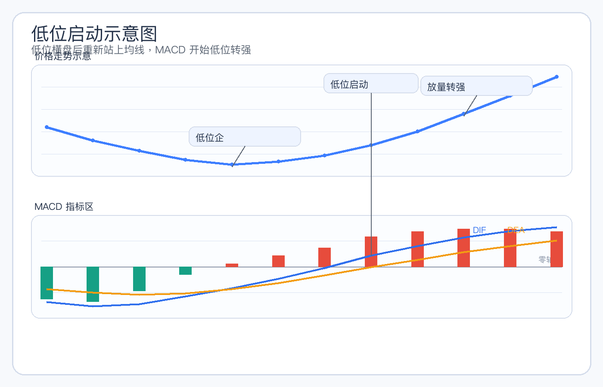
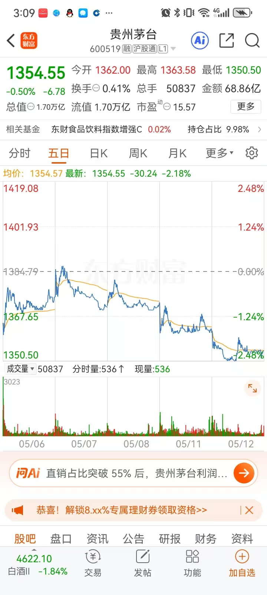
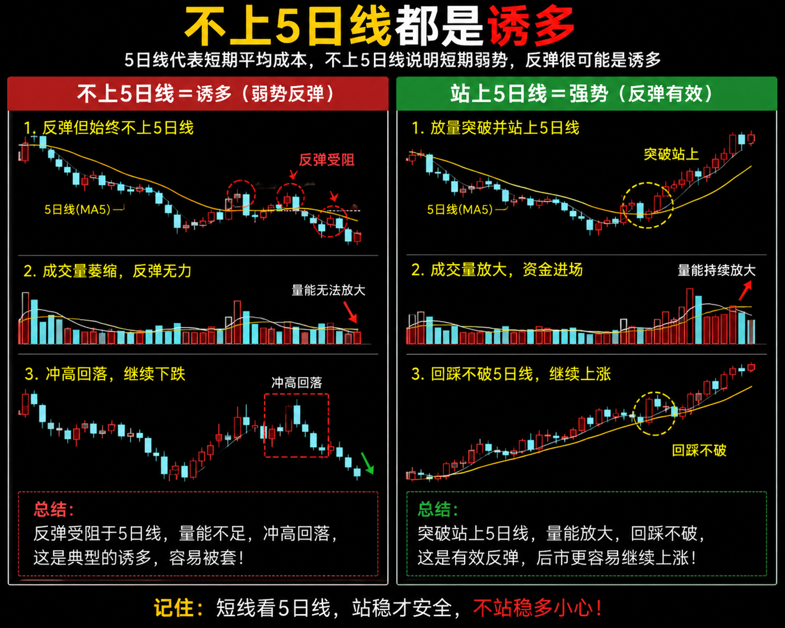

# 均线 + MACD + 成交量 + KDJ 四指标共振选股攻略

## 一、这份文档解决什么问题

很多人在看盘时，会遇到一个很典型的问题：

- 均线知道一点，但不知道怎么用它判断趋势
- MACD 会看金叉死叉，但经常一买就套
- 成交量能看出放量缩量，却不知道哪种量更有价值
- KDJ 偶尔能看到低位金叉，但经常发现信号很多、成功率却不稳定

问题不在于你没有学过这些指标，而在于：**你还没有把它们串成一套有先后顺序的选股流程。**

这份文档的目的，不是让你死记指标口诀，而是帮你建立一套适合 A 股短线与波段入门者使用的实战框架：

1. 先用均线判断趋势是否成立
2. 再用 MACD 判断趋势动能是否转强
3. 再用成交量确认资金是否真正参与
4. 最后用 KDJ 去找更合适的短线介入节奏

你可以把这套方法先记成一句话：

**趋势看均线，转强看 MACD，真假看量能，落点看 KDJ。**

需要强调的是：

**下面内容属于技术分析教学，不构成任何投资建议。**

---

## 二、四个指标分别解决什么问题

很多新手最大的误区，不是不会看指标，而是让所有指标同时说话，最后越看越乱。实际上，这四个指标各自负责的任务并不一样。

### 1. 均线：负责看趋势

均线最重要的任务，是帮助你判断：

- 当前股价是在上升、震荡，还是下降
- 这只股票是强势趋势股，还是弱势反弹股
- 回调是正常修整，还是趋势破坏

常用的几条均线可以这样理解：

- 5 日线：看短线节奏
- 10 日线：看短波段节奏
- 20 日线：看中短趋势是否稳健
- 60 日线：看更大一级的方向背景

如果一只股票满足下面这些条件：

- 股价站在 20 日线之上
- 5 日线在 10 日线之上
- 10 日线在 20 日线之上
- 均线整体向上发散

那么它通常更接近“有趋势的股票”，而不是单纯脉冲一下的票。

### 2. MACD：负责看趋势强弱与拐点

MACD 的作用，不是单独发出买卖命令，而是观察：

- 当前上涨有没有动能支持
- 回调后是否重新转强
- 看到的上涨是主升段，还是弱反弹

对入门者来说，可以先抓住三件事：

- 金叉：短期强弱开始改善
- 死叉：短期强弱开始转弱
- 红绿柱变化：动能是在增强还是减弱

真正实战里，更重要的不是“有没有金叉”，而是先判断这个金叉是不是“有质量的金叉”。判断时可以重点看三件事：

- 金叉出现在什么位置：尽量优先零轴附近或零轴上方的金叉，零轴下方的金叉往往只是弱势修复，持续性通常要打折扣。
- 金叉时均线趋势好不好：如果股价已经站上关键均线，且 5 日、10 日、20 日均线呈多头排列，说明金叉更像是趋势延续，而不是弱反弹。
- 金叉时有没有量能配合：如果金叉出现时成交量同步放大，说明有资金真正参与；如果只有指标交叉、量能却没有跟上，这种信号的可靠性通常会明显下降。

### 3. 成交量：负责确认资金是否配合

很多图形表面上很好看，但如果没有量能支持，持续性往往会很差。

成交量主要帮助你判断：

- 上涨是不是有资金推动
- 回调是不是抛压不大
- 突破是不是得到市场认可
- 高位放量到底是加速还是出货

在趋势技术流中，最受欢迎的量价节奏通常是：

- 上涨时放量
- 回调时缩量
- 突破关键位时再次放量

这种结构说明：

- 上涨阶段有人愿意追随
- 调整阶段抛压可控
- 再启动阶段有新增资金认可

### 4. KDJ：负责找短线节奏与落点

KDJ 属于更偏短线节奏类的指标。它不适合单独决定你要不要买，但很适合帮助你判断：

- 一只趋势股当前是低吸区，还是短线偏热区
- 回踩结束后，是否开始重新转强
- 当前是更适合等一等，还是可以留意介入时机

KDJ 常见用法可以先这样理解：

- 低位金叉：短线有止跌转强迹象
- 高位死叉：短线有过热回落风险
- 高位钝化：股价虽强，但追高风险明显增加

KDJ 的最大特点是灵敏，因此它的优点是“能较早看到节奏变化”，缺点是“杂波也多”。

所以你要记住：

**KDJ 只能放在最后一步使用，不能放在第一步使用。**

---

## 三、四指标共振选股的核心逻辑

所谓“四指标共振”，不是四个指标同时发出一个买字就直接进场，而是让它们按顺序分工。

### 1. 先有趋势

首先要确保这只股票不是下跌趋势中的反弹股，而是真正存在向上结构的股票。

这一关主要由均线完成。

如果均线系统还是空头排列，股价长期压在 20 日线和 60 日线下方，那么后面就算出现 MACD 金叉、KDJ 金叉，也很可能只是弱反抽。

### 2. 再看动能是否转强

趋势不代表立刻能涨，很多股票虽然趋势没坏，但短期仍在整理。

这时候需要观察 MACD：

- 是否出现重新金叉
- 是否处在零轴上方
- 红柱有没有重新放大

如果这些条件出现，通常说明趋势股结束整理、重新转强的概率更高。

### 3. 再确认资金有没有参与

如果只有价格动了，但量能没有明显改善，那很多上涨都可能只是小资金拉一下，持续性会偏弱。

所以在 MACD 转强之后，要看成交量：

- 突破时是否放量
- 回踩时是否缩量
- 再启动时是否量比回升

量能的本质是“市场认可度”。没有认可度的图形，经常好看但不好做。

### 4. 最后才看 KDJ 找节奏

当前三项都成立后，KDJ 才有实际意义。

它帮助你决定的不是“这只股能不能做”，而是“这只股现在是不是更适合上车”。

例如：

- 趋势没问题
- MACD 在转强
- 成交量在配合
- 但 KDJ 已经在高位 90 附近钝化

这时并不代表股票不能涨，而是代表：**即便逻辑没错，追高的位置也不够舒服。**

所以四指标共振的真正顺序是：

**均线筛趋势 → MACD 看转强 → 成交量做确认 → KDJ 找落点。**

---

## 四、一套可直接执行的四指标选股规则

下面给你一套适合入门者执行的简化版规则。它不是唯一标准，但足够作为稳定框架。

## 1. 均线条件

优先找满足以下条件的个股：

- 股价站上 20 日均线
- 5 日均线大于 10 日均线
- 10 日均线大于 20 日均线
- 20 日均线方向向上

如果更强一点，可以再加：

- 20 日均线在 60 日均线上方，或者正在上穿 60 日均线

这类股票更容易属于“趋势已经走出来，或者正在走出来”的类型。

## 2. MACD 条件

在均线条件成立后，再看 MACD：

优先考虑：

- DIF 上穿 DEA，形成金叉
- 金叉尽量出现在零轴附近或零轴上方
- 红柱开始重新放大
- 死叉后快速修复，说明多头韧性较强

尽量回避：

- 零轴下方的弱金叉
- 金叉出现时股价仍被均线压制
- 红柱已经大幅衰减，股价却还在勉强冲高

## 3. 成交量条件

趋势与动能都没问题后，再看量能。

优先考虑：

- 突破平台当天放量
- 向上拉升时成交量高于 5 日均量
- 回调阶段成交量缩小
- 再次启动时量比重新回升

尽量回避：

- 突破不放量
- 上涨放不出量、下跌反而放量
- 高位巨量长上影
- 放量滞涨，价格不涨反而分歧加大

## 4. KDJ 条件

最后用 KDJ 做节奏优化。

优先考虑：

- KDJ 在 20 到 50 一带重新金叉
- J 值从低位快速拐头，说明短线弹性开始释放
- KDJ 金叉与股价回踩企稳同步出现

尽量回避：

- KDJ 在 80 以上反复钝化后再追高
- 指标已经明显高位死叉，股价却还在勉强横着撑
- KDJ 只是短暂反抽，但均线与 MACD 并未配合

## 5. 综合筛选口诀

可以把这套条件浓缩成一版短句：

**股价站上 20 日线，5-10-20 均线顺向；MACD 零轴附近或上方金叉，红柱转强；上涨放量、回调缩量；KDJ 从中低位重新金叉。**

如果一只股票大体满足这些条件，它就具备了进入观察池的价值。

注意，是进入观察池，不是无脑追进。

---

## 五、最值得关注的三种实战形态

四指标共振最常用、也最容易上手的，不外乎下面三种类型。下面我把每一种都拆成“怎么看、怎么买、怎么卖、配什么图讲”，这样你在复盘时更容易直接套用。

## 1. 低位启动型

### 典型特征

- 前期经历一段调整或底部震荡，价格先跌后稳，不再继续创新低
- 股价重新站上 20 日线，最好还能连续站稳 2 到 3 个交易日
- MACD 在低位金叉，绿柱缩短后开始翻红
- 成交量开始温和放大，不是单日脉冲式爆量，而是逐步回暖
- KDJ 从低位拐头向上，说明短线节奏开始修复

### 如何观察

观察低位启动型，先别急着看“金叉出现没有”，而是先看它是不是已经具备“止跌—企稳—试探性转强”的三步结构：

1. **先看价格**：低点是否不再被连续跌破，K 线下影线逐渐增多，说明下方承接在增强。
2. **再看均线**：股价是否重新回到 20 日线之上，5 日线是否开始拐头，避免只是单日反抽。
3. **再看 MACD**：低位金叉后，红柱有没有从短到长，而不是刚金叉就再次缩回去。
4. **最后看量能**：成交量是否比前面萎缩阶段明显抬升，说明有资金开始尝试介入。

如果这四步是连起来出现的，低位启动型的可信度会更高。

### 买入点怎么理解

低位启动型不适合“看到金叉马上追”，更适合等一个**确认点**：

- 第一种确认点：放量站上 20 日线后，第一次缩量回踩不破均线，再重新转强时考虑观察。
- 第二种确认点：突破前期小平台高点时放量，并且 MACD 红柱继续放大，可以作为右侧确认点。

新手更适合把“第一次有效回踩不破”当成主要观察点，而不是一根大阳线刚出现就冲进去。

### 卖出点怎么理解

低位启动型的卖出，不是等它涨不动才慌，而是看几个风险信号：

- 股价重新跌回 20 日线下方，并且收盘不能快速收回
- 放量上涨后第二天却明显缩量滞涨，说明追买力量不足
- KDJ 进入高位后开始走钝，MACD 红柱明显缩短，短线节奏变差

如果你是做短线，通常可以把“跌破关键均线且收不回”作为第一警戒线；如果你是做波段，则可以把“放量滞涨 + 动能衰减”作为分批减仓信号。

### 配图怎么讲

这一类最适合配两张图来讲：

- **第一张图**：低位震荡阶段，价格在 20 日线附近反复试探，MACD 还在低位徘徊，量能偏小，突出“弱势修复”的背景。

- **第二张图**：股价重新站上 20 日线，MACD 低位金叉，红柱开始放大，成交量同步温和放大，突出“从弱转强”的过程。

> 对应示意图：
>
> 
> 

如果你后面要放示意图，可以在图下方写一句：**“先看是否止跌，再看是否站稳均线，最后看量能是否支持。”**

### 市场含义

这种类型的核心，是“从弱转强”。

它不是最强势的主升浪中段，而是趋势刚刚改善、资金开始重新参与的阶段。优点是位置往往相对不高，缺点是需要更重视确认，防止它只是反弹而不是反转。

### 实战重点

这类股票适合看“第一波启动质量”。如果启动时：

- 放量明显
- 站上关键均线
- 板块同步转强

那么后续往往有继续观察价值。

---

## 2. 回踩再起型

### 典型特征

- 前面已经有一段明确上升趋势，说明它不是完全从底部无序起步
- 回调时没有跌破 20 日线，或者跌破后很快收回
- 回调期间成交量缩小，表示抛压没有明显扩大
- MACD 红柱缩短但没有明显走坏，随后再次金叉
- KDJ 回落到中低位后重新拐头向上

### 如何观察

回踩再起型的关键，不是看“有没有跌”，而是看“回调是否健康”。你可以按这个顺序观察：

1. **看回调幅度**：正常回踩通常不会把前一波上涨结构完全打穿，尤其不能跌破关键均线太深。
2. **看回调量能**：真正健康的回踩，通常是价格回落，但成交量跟着缩小，说明卖压在减弱。
3. **看 MACD 状态**：红柱缩短不等于走坏，关键在于有没有在低位重新拐头，而不是一路缩到彻底失去支撑。
4. **看再次启动的节奏**：如果价格回踩后重新站回短均线，并且放量上行，说明回踩后的承接和再启动都成立。

### 买入点怎么理解

回踩再起型最常见的买点有两个：

- **回踩确认点**：股价回到 10 日线或 20 日线附近后，出现缩量止跌、KDJ 低位重新拐头，这时候属于相对稳健的观察点。
- **再启动确认点**：股价放量重新突破回踩阶段的小平台高点时，是更明确的右侧买点。

如果你偏稳健，优先等“回踩不破 + 再次放量”；如果你偏实战，可以在“缩量企稳后的首次转强”阶段提前关注，但仓位一定要控制。

### 卖出点怎么理解

回踩再起型的风险点，主要有三种：

- 回踩不是健康消化，而是直接跌破 20 日线且收不回
- 再次启动失败，反而放量下跌，说明趋势被破坏
- 价格反弹时 KDJ 已经高位钝化，但 MACD 红柱没有同步放大，说明短线弹性不足

简单说，如果“回踩后再起”没有出现第二次有效确认，就不能把它当成趋势延续。

### 配图怎么讲

这一类最适合配“前涨—回踩—再起”三段式截图。

- **第一张图**：先展示前面一波上升趋势，让读者知道这是趋势股，不是纯底部股。
- **第二张图**：展示回踩阶段，价格靠近 20 日线，成交量缩小，MACD 红柱收窄但未完全破坏。
- **第三张图**：展示再次放量拉升，MACD 二次转强，KDJ 同步回升。

> 对应示意图：
>
> 
> 
> 

如果你后面想换成更贴合这三步的专用截图，也可以继续替换成你自己的示意图。

配图时可以强调一句：**“回踩不是坏事，关键是回踩后有没有重新被资金接住。”**

### 市场含义

这类形态往往比低位启动型更成熟，因为它不是完全从弱势区起步，而是在一个已有趋势中的二次确认。

它的本质是：

- 前面已经证明这只股票有上涨能力
- 中间通过回调消化浮筹
- 回踩后再次转强

### 实战重点

很多趋势股最好做的一段，不是第一根大阳线，而是**第一次比较健康的回踩再起**。

因为这个位置通常同时具备：

- 趋势仍在
- 风险比追高更可控
- 指标更容易形成二次共振

---

## 3. 二次金叉型

### 典型特征

- 股价仍处在偏强结构中，说明趋势并没有被破坏
- MACD 第一次金叉后出现小回调，但回调没有击穿关键均线
- 第二次金叉重新出现，且位置通常比第一次更强
- 成交量在二次转强时重新放大，说明资金再次认同
- KDJ 同步从整理区再次拐头向上，短线节奏重新改善

### 如何观察

二次金叉型最容易让人误判，因为“第二次金叉”听起来很强，但它真正有价值的前提，是第一次转强之后，趋势没有被打坏。你可以重点看这四件事：

1. **看第一次金叉后的走势**：如果第一次金叉后价格只是横盘整理，没有明显破位，说明多头还在。
2. **看第二次金叉的位置**：如果第二次金叉出现在零轴附近或零轴上方，通常质量更好。
3. **看量能是否重新抬升**：二次金叉如果没有量能配合，容易只是指标修复。
4. **看板块环境**：如果同板块个股也在同步转强，说明这不是单独个股的偶然动作。

### 买入点怎么理解

二次金叉型的买点，通常比低位启动型更偏“顺势跟随”：

- **第一种买点**：第一次回调结束后，价格重新站上短均线，MACD 二次金叉刚形成时，可以作为观察点。
- **第二种买点**：二次金叉后再次放量突破整理平台高点，是更明确的确认点。

如果你是做波段，第二种买点通常比第一种更稳；如果你是做短线，第一种买点弹性可能更高，但容错率更低。

### 卖出点怎么理解

二次金叉型的卖出逻辑，要重点盯住“二次转强是否兑现”：

- 如果二次金叉后价格没有放量突破，反而再次回落，说明共振失败
- 如果 MACD 红柱开始缩短，而股价却迟迟上不去，说明上涨动能在变弱
- 如果股价冲高后出现放量长上影，常常意味着分歧变大，短线要提高警惕

对持股者来说，最实用的卖出原则不是猜顶，而是：**放量突破后不能继续延续，就要准备减仓；如果跌破二次金叉前的平台支撑，优先防守。**

### 配图怎么讲

这一类最适合配“第一次金叉—整理—第二次金叉”的对比图。

- **第一张图**：展示第一次金叉后的上涨基础，让读者知道趋势已经先走出来。
- **第二张图**：展示整理阶段，股价横盘、量能缩小、MACD 红柱回落但未完全失真。
- **第三张图**：展示二次金叉重新出现、量能回升、价格突破平台，突出“二次启动”的质量。

> 对应示意图：
>
> 
> 
> 

图注可以写成：**“不是所有二次金叉都强，只有建立在趋势未坏、量能回升、位置更优的二次金叉，才更值得重视。”**

### 市场含义

二次金叉型的本质，是第一次转强后并没有完全走完，经过一次中继整理后再次启动。

很多强势股在主升前，都会经历类似过程。

### 实战重点

要注意区分“强势二次金叉”和“弱反弹二次金叉”：

强势二次金叉通常具备：

- 均线没有明显走坏
- MACD 尽量运行在零轴上方
- 成交量没有明显失真
- 板块仍有热度

如果二次金叉出现在均线空头、零轴下方、量能衰竭背景中，那意义就会弱很多。

---

## 六、结合图片做教学说明

下面结合你现有的图片素材，讲清楚这套方法如何落地。

## 1. 案例总览图：先看趋势骨架

这张图最适合做第一眼观察，也就是先不急着钻进指标，而是先看股票的大结构。

你看到这类图时，先问自己四个问题：

1. 股价是不是整体震荡抬高
2. 是否有一段比较清晰的上升趋势
3. 调整后有没有重新走强的动作
4. 上涨不是一天脉冲，而是有结构地推进

如果这四个问题的答案大体偏正面，那么说明这只股票至少值得进入下一步分析。

教学重点在于：

**先看结构，再看指标。**

如果大结构都不对，后面的四指标再漂亮，也容易失真。

---

## 2. 均线辅助图：看短节奏是否配合趋势

这张图更适合帮助你理解短线节奏，而不是单独作为买入理由。

你重点观察：

- 5 日线是不是始终能托住价格
- 股价跌回 5 日线后，是否容易获得支撑
- 如果跌破 5 日线，是否还能在 10 日线或 20 日线附近企稳

在强势股里，经常会出现这样的节奏：

- 拉升阶段沿 5 日线运行
- 短调阶段回踩 10 日线或 20 日线
- 再次启动时又回到 5 日线上方

这说明均线不是死规则，而是趋势节奏的参考带。

教学重点在于：

**均线不是让你追着一条线买，而是让你理解这段上涨是否有秩序。**

---

## 3. MACD 金叉图：看动能是否真正转强

这张图适合用来理解“MACD 转强”这个概念。

你可以重点看三件事：

- DIF 是否上穿 DEA
- 金叉后红柱是否逐渐放大
- 金叉出现时，股价本身是不是已经止跌或转强

如果看到的是：

- 低位金叉
- 红柱逐步放大
- 股价同步站回关键均线

那么这个信号就更容易属于“有效转强”。

但如果只是指标金叉，而股价仍被均线压着，或者量能没有改善，那这种金叉就更像技术性反抽。

教学重点在于：

**MACD 最有价值的不是发出一个叉，而是告诉你动能是否配得上价格的变化。**

---

## 4. MACD 零轴上方二次金叉：更有质量的再启动

这类图在趋势技术流里通常更受欢迎，因为它往往意味着：

- 前面已经有过一段上涨
- 中途整理没有破坏趋势
- 第二次金叉出现在更强的背景中

你在实战中看到这种图形时，要同步确认：

- 均线是否仍偏多头排列
- 回调有没有缩量
- 二次启动时是否重新放量

如果这些条件都在，那么二次金叉的意义通常会强于第一次低位试探性金叉。

---

## 5. MACD 零轴下方弱金叉：为什么很多人一买就套

这类图非常适合拿来教学避坑。

很多新手只看到“金叉”两个字，却忽略了位置。零轴下方金叉往往意味着：

- 股票整体仍在弱势区
- 即使短线反弹，也未必能持续
- 一旦均线还是空头结构，信号质量会更差

所以看到这种图形时，正确反应不是兴奋，而是多问一句：

**这到底是趋势转强，还是弱势股的一次短反弹？**

如果均线没修复、量能没跟上、板块没配合，这种信号通常不要高看。

---

## 6. MACD 红柱放大：为什么它比单看金叉更有用

红柱放大说明多头动能在增强。

它最大的价值在于：

- 可以帮助你判断上涨是不是越走越强
- 可以帮助你辨别回踩后是否重新启动
- 可以辅助确认突破是否更有质量

实战里，如果你同时看到：

- 均线顺向
- 股价突破平台
- 成交量放大
- MACD 红柱重新放大

那么这类上涨就更容易属于“有持续性的强势”，而不是单日异动。

---

## 7. 高位钝化与顶背离：为什么好股票也不能乱追

这两张图最重要的教学意义，是提醒你：

- 指标强，不代表任何位置都能买
- 趋势后期，动能衰减往往先于价格明显转弱

当你看到：

- 股价还在创新高或接近新高
- 但 MACD 红柱不再放大，甚至缩短
- 或者出现明显顶背离迹象

就要意识到：

这时即便股票还没立刻掉头，追高的性价比也在下降。

这就是为什么 KDJ 要放在最后一步看。因为高位 KDJ 常常会先告诉你：

- 当前节奏已经偏热
- 即使大趋势没坏，也不适合情绪化追进

---

## 七、把 KDJ 放进实战流程里怎么用

因为你当前素材里主要是 MACD 图片，所以 KDJ 这里我用文字教学方式讲清楚最常用的实战法。

## 1. KDJ 最适合解决什么问题

KDJ 最适合解决的是：

- 同样是一只趋势股，现在是追高，还是低吸
- 同样是回踩企稳，现在是刚企稳，还是已经短线过热
- 同样是 MACD 金叉，现在是更适合等回踩，还是可以开始留意节奏

### 2. KDJ 的正确顺序

KDJ 一定要放在最后看：

- 如果均线没走好，先别看 KDJ
- 如果 MACD 没转强，先别看 KDJ
- 如果成交量没配合，先别看 KDJ

因为 KDJ 太灵敏，单独使用会出现很多“看起来马上要涨，结果只是小反抽”的情况。

### 3. KDJ 的三种高频用法

#### 第一种：中低位重新金叉

如果一只股票本身处在上升趋势中，回调后 KDJ 从 20 到 50 一带重新金叉，这往往说明短线节奏重新改善。

这类信号最适合配合：

- 回踩 10 日线或 20 日线企稳
- MACD 红柱重新放大
- 成交量回暖

#### 第二种：高位钝化不追高

如果一只股票连续上涨后，KDJ 长时间在 80 以上运行，即使股价还在涨，也要提高警惕。

这不一定代表马上下跌，但通常代表：

- 短线已经不便宜
- 继续追高，盈亏比在下降
- 最好等一次回踩或整理后再观察

#### 第三种：高位死叉防短调

如果股票已经涨了一段，KDJ 高位死叉，而 MACD 红柱也同步缩短，就要防止进入短线调整。

这时不是一定清仓，而是要意识到：

- 追高不合适
- 持股者要观察是否跌破关键均线
- 想新开仓的人最好等下一次节奏修复

---

## 八、四指标联动选股的完整流程

如果你每天要从很多股票里做筛选，可以按下面顺序走。

## 第一步：先排除明显弱势股

先把这些股票排掉：

- 长期在 20 日线和 60 日线下方运行
- 均线空头排列
- 成交长期低迷
- 板块整体偏弱

这样做的好处是，你不会被很多“偶尔金叉一下”的弱势股干扰。

## 第二步：留下趋势结构成立的票

重点保留：

- 站上 20 日线
- 5 日、10 日、20 日均线顺向
- 最近有过一段趋势推进
- 回调没有明显破坏结构

这一步相当于先找“有骨架”的股票。

## 第三步：在这些票里找 MACD 转强信号

观察：

- 是否金叉
- 是否零轴附近或零轴上方转强
- 红柱是否重新放大

这一步找的是“正在启动”或“准备再启动”的票。

## 第四步：再用量能做真假筛选

观察：

- 突破时有没有放量
- 回调时有没有缩量
- 再启动时有没有量比回升

如果没有量能支持，就要降低预期。

## 第五步：最后用 KDJ 优化介入时机

如果 KDJ 处在中低位重新拐头，你的落点通常会更舒服；如果已经高位钝化，就要防止追在短线过热区。

---

## 九、四指标之外，实用的补充指标（按优先级）

如果你已经把均线、MACD、成交量、KDJ 这四个核心指标看顺了，下面这些补充指标也很实用。它们不是替代核心指标，而是帮助你更快缩小观察范围、提高选股效率。

### 1. 板块 / 行业强弱

这是最值得先看的补充项，优先级通常排第一。

为什么重要：

- 个股强不强，很多时候先看板块强不强
- 强势板块里更容易出趋势股和龙头股
- 只有个股强、板块弱的票，持续性往往更差

怎么看：

- 先看板块是否在涨幅榜前列
- 再看这个板块里是不是有一批股票同步走强
- 最后看这只股票是不是板块里的领涨或强势跟随者

### 2. 相对强弱（RS / 涨幅排名）

相对强弱的核心，不是“绝对涨了多少”，而是“比别人强不强”。

为什么重要：

- 同样是上涨，跑赢大盘和同板块才更有意义
- 选股时优先挑相对强于指数、强于同类的票
- 它能帮助你更快找到龙头或者准龙头

怎么看：

- 看近期涨幅是否持续领先
- 看是不是在回调阶段也比同类抗跌
- 看是否经常出现在板块内涨幅前排

### 3. 换手率

换手率适合判断股票有没有“真实活跃度”。

为什么重要：

- 低位启动时，温和放大的换手率往往说明有人在接力
- 中段上升时，合理换手有助于换筹和延续趋势
- 高位如果换手过大，常常意味着分歧加大，要更谨慎

怎么看：

- 太低：成交太冷清，容易没人接力
- 适中：活跃度够，趋势更容易延续
- 过高：尤其在高位，容易出现分歧或派发

### 4. 量比

量比更适合看短线当天有没有突然放量。

为什么重要：

- 它能帮助你快速发现异动
- 对突破、反包、再启动这类场景很有帮助
- 比单看成交量更适合盯盘时做快速筛选

怎么看：

- 突破时量比明显抬升，说明有资金跟进
- 回踩时量比缩小，说明抛压在减弱
- 高位量比突然放大，要警惕波动加剧

### 5. OBV / 资金流向

这类指标更偏“资金是否在持续累积”。

为什么重要：

- 价格可以短期做出来，但资金累积往往更能说明趋势质量
- 适合辅助判断是不是有人在悄悄吸筹
- 对趋势股和中线票尤其有参考价值

怎么看：

- 价格横盘时，OBV 先抬升，可能说明资金先行
- 价格上涨、OBV 同步走强，通常更健康
- 价格创新高、OBV 不跟，说明动能可能在减弱

### 6. 布林带

布林带适合看“收口—扩张—方向选择”的节奏。

为什么重要：

- 收口阶段常常意味着行情在积蓄能量
- 向上开口时，往往代表趋势正在扩展
- 对突破和回踩确认都比较好用

怎么看：

- 布林带收口：市场可能在酝酿方向
- 站上中轨：说明短线开始转强
- 沿上轨运行：说明强势趋势还在

### 7. RSI

RSI 更适合做辅助节奏判断，不适合单独当买入理由。

为什么重要：

- 能帮助你看超买、超卖状态
- 对判断“还能不能追”有帮助
- 适合和均线、KDJ 一起看，而不是单独用

怎么看：

- 低位 RSI 重新抬头，可辅助观察反转节奏
- 高位 RSI 长时间钝化，要防止追高
- 最好结合趋势和量能一起判断

### 推荐优先级

如果你想按实战选股的优先级来排，可以简单记成下面这个顺序：

**板块 / 行业强弱 → 相对强弱 → 均线结构 → MACD 动能 → 成交量 / 换手率 → 量比 → OBV / 资金流向 → 布林带 → RSI**

其中最值得优先补充看的，通常是：

- 板块 / 行业强弱
- 相对强弱
- 换手率
- 量比

这四项最容易和你前面的四指标形成互补。

---

## 十、最常见的四个陷阱

## 1. 均线刚站上就以为趋势稳了

有些股票只是超跌反弹，刚刚站上均线，但均线本身还没有真正走顺。

这时如果你只看“站上均线”四个字，而不看均线方向和结构，很容易误判成趋势股。

## 2. 只看 MACD 金叉，不看零轴位置

零轴下方金叉，很多时候只是弱反弹信号。真正更有参考价值的，通常是零轴附近修复或零轴上方二次转强。

## 3. 只看放量，不看位置

低位放量和高位放量，意义完全不同。

- 低位放量，可能是资金开始参与
- 高位巨量，可能是分歧加大甚至派发

所以量能一定要结合位置与趋势看。

## 4. 把 KDJ 当成提前预测工具

KDJ 只能帮助你优化节奏，不能替代趋势判断。

如果你总是看到 KDJ 金叉就提前抄底，往往会不断买在弱势反抽里。

---

## 十、一页实战口诀

为了方便你每天复盘时快速调用，可以把全文浓缩成下面这版口诀：

**先看均线，趋势不对不做。**

**再看 MACD，动能不强不急。**

**再看量能，无量上涨少追。**

**最后看 KDJ，高位钝化不冲。**

再缩成一句：

**趋势看均线，转强看 MACD，真假看量能，落点看 KDJ。**

---

## 十一、给入门者的实战执行建议

如果你现在刚开始练这套方法，不建议你一上来就同时看几百只股票。

更好的方式是：

### 1. 每天固定复盘 5 到 10 只票

重点复盘：

- 强势股为什么强
- 弱势股为什么弱
- 哪些股票趋势、动能、量能、节奏能互相配合

### 2. 只训练一种形态

先只练一种，例如：

- 回踩 20 日线后重新转强
- 零轴上方二次金叉
- 缩量回踩后放量再启动

把一种形态看熟，比同时学十种更有效。

### 3. 做记录，不凭感觉

每次看到一只你觉得不错的股票，都简单写下：

- 均线状态
- MACD 状态
- 成交量状态
- KDJ 状态
- 你为什么觉得它值得观察

时间一长，你会逐渐形成自己的判断标准。

---

## 十二、最后总结

四指标共振选股，最重要的不是“把四个指标都背熟”，而是知道它们各自负责什么。

- 均线负责筛趋势
- MACD 负责看动能
- 成交量负责做资金确认
- KDJ 负责优化节奏

真正实战里，最怕的不是指标不会看，而是顺序错了。

如果你把 KDJ 放到第一位，就容易天天抄到弱反弹；如果你把均线放到第一位，再让 MACD、量能、KDJ 一层层确认，思路就会清晰很多。

所以请记住这句话：

**先筛趋势，再等转强，再看资金，最后找节奏。**

这就是“均线 + MACD + 成交量 + KDJ”这四个指标最适合入门者的组合方式。
