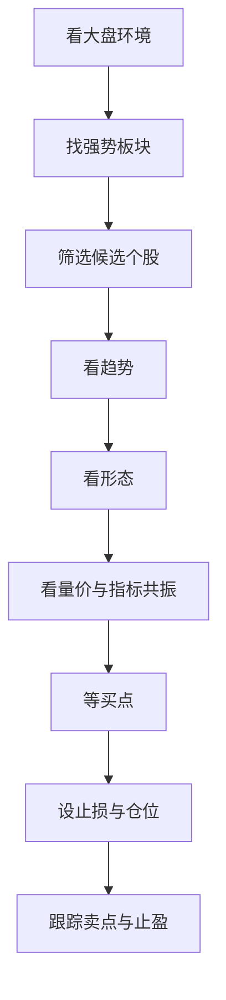

# 技术流如何选股：从趋势、形态、指标到买卖点的完整实例

## 一、这份文档解决什么问题

很多人在学技术分析时，往往会遇到同一个问题：

- 均线会看一点
- MACD 会看一点
- 成交量也知道一点
- 但真到实战里，还是不知道该怎么把这些东西串起来

这份文档的目标，不是教你再多背几个指标，而是带你按一套完整顺序，把技术流选股真正串起来：

1. 先看大盘环境
2. 再看板块强弱
3. 再筛选个股
4. 再看趋势是否成立
5. 再看形态是否清晰
6. 再用指标和量价做确认
7. 再确定买入点
8. 最后提前规划卖出点、止盈点和止损点

你可以把技术流理解为一句话：

**不是去猜最低点和最高点，而是在趋势已经逐步走出来以后，跟随其中更容易赚钱的一段。**

---

## 二、先给你一张完整流程图

如果你以后复盘时思路乱了，就回到这九个字：

**先环境，后板块，再个股，最后时机。**

---

## 三、案例说明：为什么选择东方财富作为教学案例

这份文档以下面的教学案例来展开：

**案例股：东方财富**

之所以选择它，不是因为它一定会涨，也不是为了做推荐，而是因为它更适合教学拆解：

- 市场认知度高，很多人都熟悉
- 通常成交活跃，量价关系更容易观察
- 趋势结构、均线配合、放量与回踩的教学意义比较强
- 适合拿来讲“趋势确认、形态观察、买卖点拆解”这一整套流程

需要特别注意：

**下面的内容属于技术教学案例，不构成投资建议。**

---

## 四、案例配图总览

### 1. 案例股示意图

这张图可以作为案例股的总览图。阅读时你重点观察：

- 股价是否处在明显上升趋势中
- 是否出现过平台整理
- 整理后有没有再次放量启动
- 均线是否整体向上

### 2. 均线节奏辅助图

这张图主要用于理解短节奏，不是单独作为买卖依据。你要把它放到完整结构里去看。

### 3. MACD 辅助理解图

MACD 这类图更适合帮助你理解“趋势动能的变化”，而不是机械地看到金叉就买。

---

## 五、第一步：先看大盘环境

技术流选股第一步永远不是翻个股，而是判断：

**现在这个市场值不值得出手。**

### 1. 为什么要先看大盘

因为多数个股并不是独立运行的。市场环境好的时候，趋势股更容易走出持续性；市场环境差的时候，就算图形不错，也容易冲高回落。

### 2. 看大盘主要看什么

#### 指数趋势
重点看：

- 上证指数
- 深证成指
- 创业板指
- 中证1000

要看这几个问题：

- 指数是在上涨、震荡，还是下跌
- 指数是否站上 5 日、10 日、20 日、60 日均线
- 均线是否处在多头排列中

#### 量能
看市场成交额是否活跃：

- 放量上涨：市场情绪偏积极
- 缩量上涨：有上涨，但持续性要多观察
- 放量下跌：风险释放较大
- 缩量阴跌：弱势状态明显

#### 情绪
观察：

- 涨停家数多不多
- 跌停家数多不多
- 强势题材是否持续
- 龙头股是否能连续超预期

### 3. 如何得出结论

大盘环境一般分三类：

#### 上升环境
- 指数向上
- 热点集中
- 市场成交活跃

这种环境下，更适合做强势趋势股。

#### 震荡环境
- 指数没有明显单边方向
- 板块轮动很快

这种环境下，可以做，但要更注重买点，不宜盲目追高。

#### 下跌环境
- 指数走弱
- 热点持续性差
- 赚钱效应偏弱

这种环境下，技术流更强调防守，宁愿少做。

### 4. 应用到本案例时的思路

如果你准备观察东方财富这样的个股，第一反应不应该是“这只票涨得不错”，而是先问：

- 当前大盘是否支持趋势股继续表现
- 券商或互联网金融方向是否有资金回流
- 市场是否处在进攻期

如果大盘和情绪都偏弱，那么再漂亮的图形，也要降低预期。

---

## 六、第二步：再看板块强弱

技术流选股不能脱离板块。很多强势股之所以强，不只是它自己强，而是因为它背后有板块共振。

### 1. 为什么板块这么重要

一只股票上涨，常常来自几个因素：

- 板块热点
- 政策催化
- 资金集中攻击
- 行业景气提升

如果板块强，个股更容易走出持续趋势；如果板块弱，个股往往只能单点异动，持续性会明显差很多。

### 2. 看板块强弱的方法

#### 看涨幅排名
观察当天和近几天：

- 哪些板块排名靠前
- 是一天脉冲，还是连续走强
- 板块里是否有多个个股联动上涨

#### 看板块趋势
一个真正有持续性的板块，通常有这些特征：

- 板块指数沿均线逐步抬升
- 回调不深
- 龙头不断创出阶段新高
- 后排个股出现补涨

#### 看龙头强度
板块有没有核心股票持续走强，这很关键。没有龙头带动的板块，通常很难走远。

### 3. 应用到本案例时的思路

东方财富通常会被归入这些关注方向：

- 券商
- 互联网金融
- 大金融
- 与指数情绪高度相关的权重活跃方向

当这些方向同时转强时，东方财富的趋势信号通常更有参考价值。反过来，如果板块整体不动，只是个股单独拉一下，就要小心它只是短暂波动。

### 4. 这一阶段的结论

先板块，后个股。你要找的不是“市场里随便一只图形不错的票”，而是：

**强板块里的强个股。**

---

## 七、第三步：在板块里筛出候选个股

到了这里，才真正进入选股环节。

### 1. 技术流筛股的核心标准

你可以先用这一套标准初筛：

- 股价站上 20 日均线
- 5 日均线大于 10 日均线，10 日均线大于 20 日均线
- 最近一段时间高点和低点在抬高
- 成交活跃，不是冷门票
- 没有明显破位
- 所属板块近期偏强

### 2. 为什么东方财富适合放进候选池

从教学角度看，它通常具备这些观察价值：

- 容易形成趋势波段
- 放量和缩量的节奏比较明显
- 均线结构可读性强
- 回踩与再启动结构相对典型

### 3. 这一阶段要避免的错误

不要因为某只票突然大涨一天就把它当成趋势股。真正值得跟踪的候选股，要满足的是：

- 趋势有持续性
- 不是纯消息一日游
- 不是高位爆量后强撑
- 不是下跌趋势中的超跌反弹

---

## 八、第四步：怎么看趋势是否成立

趋势是技术流的核心。不会看趋势，后面的形态、指标、买点都会变形。

### 1. 什么叫上涨趋势

最简单的判断方式就是看两个结构：

- 高点是否不断抬高
- 低点是否不断抬高

如果股价一波比一波高，回调后的低点也没有明显下移，那它大概率就是一个健康的上升趋势。

### 2. 均线怎么看趋势

在技术流里，最常用的是：

- 5 日线：看短节奏
- 10 日线：看短波段
- 20 日线：看中短趋势
- 60 日线：看更大级别方向

如果你看到：

- 股价站上 20 日线
- 5 日线上穿 10 日线
- 10 日线上穿 20 日线
- 均线整体向上发散

那么这个趋势就更像是在走强，而不是简单反弹。

### 3. 应用到本案例时的判断方式

观察东方财富时，你可以依次问自己：

1. 股价是否站在关键均线上方
2. 回调后有没有跌破前一个关键低点
3. 回调时是急跌破位，还是缩量整理
4. 回踩均线后是否重新放量转强

如果答案是：

- 趋势结构没坏
- 回调缩量
- 均线没有被有效跌穿
- 后续又重新放量上攻

那就说明这只股仍然属于“可继续观察的趋势股”，而不是应该直接排除的对象。

### 4. 趋势走坏的典型信号

以下信号一旦出现，就要提高警惕：

- 跌破平台下沿
- 跌破 20 日均线后迟迟站不回去
- 放量长阴破位
- 高点不再抬高，低点持续下移

趋势一旦走坏，后面的所有“指标好像还行”都要让位给结构本身。

---

## 九、第五步：怎么看形态是否清晰

趋势告诉你方向，形态告诉你节奏。

### 1. 技术流最常见的几种形态

#### 平台整理
股价上涨一段后，没有继续急拉，而是在一个区间里横向整理。

这类整理的价值在于：

- 前期获利盘得到消化
- 筹码开始重新交换
- 如果后面向上突破，往往意味着新一段行情启动

#### 回踩确认
股价突破后，不是一口气一直涨，而是回头测试支撑位。

如果回踩时量能缩小、价格不破关键位，再次转强，这通常是更稳的买点。

#### 二次启动
第一波上涨后，股价短暂休整，然后再次放量上行。

这通常是趋势股里性价比很高的机会。

### 2. 把案例股放到形态框架里看

以东方财富这种教学型案例来说，更值得关注的不是最低点，而是这类结构：

- 前面已经有一段上涨
- 中间进入平台或回踩整理
- 整理过程没有明显破位
- 再次放量向上

这说明市场不是简单脉冲，而是存在一轮相对完整的趋势节奏。

### 3. 形态分析最容易犯的错误

#### 错误一：把反弹当启动
股价跌多了以后突然拉一根阳线，不等于趋势转强。

#### 错误二：把震荡当平台
真正的平台是有边界、有节奏的，不是乱晃。

#### 错误三：看到突破就追
突破要看是否有效，是否有量，是否有板块配合。

---

## 十、第六步：如何用指标和量价做确认

技术流不是不用指标，而是不让指标替代结构。

真正实用的方式是：

**先看趋势和形态，再让指标来确认。**

### 1. 均线：确认趋势方向

均线最重要的作用不是告诉你精确买点，而是帮助你判断：

- 当前是不是多头结构
- 回调是否仍在可接受范围内
- 趋势有没有被破坏

当案例股满足这些条件时，均线的参考价值更高：

- 5 日、10 日、20 日均线整体向上
- 股价回踩均线后企稳
- 没有持续跌破中短期均线

### 2. 成交量：确认资金是否真正参与

量价关系在技术流里非常重要。

你要优先找的节奏是：

- 上涨时放量
- 回调时缩量
- 突破关键位置时明显放量

这说明：

- 上涨时有资金推动
- 调整时抛压不大
- 再次上攻时有新增资金认可

如果你在东方财富这类个股上看到了这种量价配合，那么趋势的可靠性会明显提高。

### 3. MACD：确认动能变化

MACD 不是独立的买卖按钮，而是用来看：

- 动能是在增强还是减弱
- 当前上涨是主升还是反弹
- 回调后是否重新转强

教学上你可以重点观察这几种情况：

- 零轴上方的金叉，比零轴下方的金叉更强
- 红柱重新放大，说明上涨动能再增强
- 高位红柱缩短但价格不再创新高，要小心动能衰减

### 4. 指标共振的正确理解

所谓共振，不是指标越多越好，而是以下几个条件能同时成立：

- 趋势向上
- 形态清晰
- 量价健康
- MACD 没有明显走坏
- 板块同步配合

如果只有指标金叉，但趋势不对、位置很高、量价很乱，那不叫共振，那叫误判。

---

## 十一、第七步：如何确定真正的买入点

会选股，不等于会买。真正把胜率和盈亏比拉开差距的，是买点。

技术流里最常见的买点有三类。

### 1. 突破买点

#### 适用场景
- 平台整理后向上突破
- 突破前高
- 放量站上关键压力位

#### 买入逻辑
说明多空平衡被打破，新的买盘开始主导价格。

#### 成立条件
- 有量能配合
- 板块不弱
- 不是高位连续大涨后的最后冲顶

#### 风险
如果突破后立刻回落，可能是假突破。

### 2. 回踩买点

#### 适用场景
- 个股已经走出上升趋势
- 突破后出现回踩
- 回踩时缩量，随后重新企稳

#### 买入逻辑
相比追突破，回踩买点通常更稳，止损位也更清晰。

#### 成立条件
- 没跌破关键支撑
- 缩量回踩
- 出现止跌信号

### 3. 二次启动买点

#### 适用场景
- 第一波上涨后，股价横盘整理
- 调整时间适中
- 再次放量启动

#### 买入逻辑
说明主导资金没有离场，而是在消化浮筹后继续拉升。

---

## 十二、把买点放到东方财富案例里怎么理解

如果把这只案例股按教学逻辑拆开，你可以这样做判断：

### 情况 A：平台突破时买

适合偏主动型交易者。

要求是：

- 前面已经有一段趋势
- 近期横盘整理
- 突破当天放量
- 板块同步走强

这种买法的优点是可能更早上车，缺点是容易遇到假突破。

### 情况 B：突破后回踩确认再买

适合偏稳健型交易者。

要求是：

- 先突破
- 再回踩关键均线或平台上沿
- 回踩不破
- 随后重新转强

这种买法的优点是确认度更高，缺点是可能买得稍高一点。

### 情况 C：整理后的二次启动买

适合做趋势延续。

要求是：

- 第一波已经走强
- 整理期间没有明显破位
- 再次放量上攻
- MACD 动能重新改善

### 实战上更推荐哪一种

如果你还在建立体系，通常更推荐：

**回踩确认买点 > 二次启动买点 > 盲目追突破。**

因为前两者更容易控制风险。

---

## 十三、第八步：如何设置止损点

技术流里，止损不是悲观，而是专业。

### 1. 为什么必须先想止损

因为没有任何一种技术信号能保证百分之百正确。真正稳定的人，不是从不看错，而是看错后亏得小。

### 2. 最常用的三种止损方法

#### 结构止损
最符合技术流逻辑。

常见放法：

- 跌破平台下沿
- 跌破前一个关键低点
- 跌破突破位后无法收回

#### 均线止损
适合趋势股。

常见放法：

- 跌破 10 日线或 20 日线
- 跌破后次日不能快速修复

#### 时间止损
如果买入后长时间不涨，走势明显弱于预期，也应退出。

### 3. 放到本案例里的实际理解

如果你买的是突破买点，那么止损通常更贴近突破位；
如果你买的是回踩买点，那么止损可以放在回踩低点下方；
如果你买的是二次启动买点，那么止损要看整理平台是否被破坏。

### 4. 一个很重要的原则

**止损应该由图形结构决定，而不是由情绪决定。**

不是“我想再等等”，而是“结构是否还成立”。

---

## 十四、第九步：如何确定卖出点和止盈点

买点解决的是怎么进，卖点解决的是怎么走。

### 1. 卖出点的几种常见逻辑

#### 趋势破坏卖
这是最核心的卖点。

典型信号包括：

- 跌破重要均线
- 跌破平台支撑
- 放量长阴破位
- 高低点结构开始转弱

#### 放量滞涨卖
如果股价在高位放出巨量，却涨不动，往往说明分歧正在加大。

#### 到达压力位分批卖
比如：

- 前高附近
- 大级别套牢区
- 明显箱体目标位

#### 情绪过热分批卖
当市场和个股同时进入高亢奋状态时，不要总想着卖在最高点，分批止盈往往更现实。

### 2. 止盈怎么理解更合理

止盈不是“赚一点就跑”，而是在合理位置兑现利润。常见方法：

- 按压力位止盈
- 按趋势破坏止盈
- 按分批减仓止盈

### 3. 在案例股上的思路

如果东方财富这种趋势股已经出现：

- 高位放量但不再创新高
- MACD 红柱持续缩短
- 板块热度明显下降
- 股价跌破关键支撑

那么无论你前面赚多少，这里都应该优先考虑兑现，而不是继续幻想。

---

## 十五、把整只案例股的操作流程完整串起来

下面给你一个更接近实战复盘的版本。

### 第一步：为什么会关注到它

因为它通常具备这些特点：

- 成交活跃
- 板块属性明确
- 趋势结构可读性强
- 容易出现平台整理后再启动的机会

### 第二步：为什么把它放进候选池

因为它如果同时满足：

- 大盘环境不差
- 券商或金融方向走强
- 股价站上 20 日均线
- 均线逐步多头排列
- 回调没有明显破位

那么它就具备继续观察的价值。

### 第三步：为什么认为趋势成立

因为从图形逻辑上看，真正的趋势股应该具备：

- 高点抬高
- 低点抬高
- 回调缩量
- 上涨放量

而不是一日脉冲后迅速回落。

### 第四步：为什么形态值得等

因为平台整理、回踩确认、二次启动，通常意味着：

- 前期获利盘得到消化
- 多空分歧在减弱
- 后续一旦向上突破，延续性往往更好

### 第五步：为什么这里可以考虑买

不是因为“感觉差不多了”，而是因为：

- 趋势还在
- 形态清晰
- 量价配合健康
- MACD 动能没有明显走坏
- 板块在配合
- 买点有结构支撑

### 第六步：为什么止损放在这里

因为止损必须放在“结构失效”的位置，而不是放在你心理舒服的位置。

### 第七步：为什么卖在这里

因为趋势股最忌讳的是已经出现明显走弱信号，还抱着“再等等”的心态不动。真正成熟的交易，不是卖在最高，而是按照规则离开。

---

## 十六、一套可以直接套用的技术流选股模板

你以后每天复盘时，可以直接按这张清单检查。

### 1. 市场环境检查

- 大盘是上涨、震荡还是下跌
- 成交额是否活跃
- 情绪是否支持进攻

### 2. 板块强弱检查

- 所属板块是否强
- 板块是否连续活跃
- 是否有龙头带动

### 3. 个股趋势检查

- 是否站上 20 日均线
- 5 日、10 日、20 日均线是否偏多头
- 高低点是否抬升

### 4. 形态检查

- 是否平台整理
- 是否回踩确认
- 是否二次启动
- 是否有明显前高压力

### 5. 量价检查

- 上涨是否放量
- 回调是否缩量
- 是否高位放量滞涨

### 6. 指标确认

- MACD 是否明显走坏
- 金叉出现的位置是否合理
- 红柱是否重新放大

### 7. 买点检查

- 是突破买点、回踩买点还是二次启动买点
- 这个买点有没有板块配合
- 有没有清晰止损位

### 8. 风控检查

- 单笔仓位多大
- 止损放哪里
- 如果不及预期怎么办

### 9. 卖点计划

- 趋势破坏是否离场
- 到压力位是否减仓
- 放量滞涨是否止盈

---

## 十七、技术流选股最容易犯的错误

### 1. 只看指标，不看结构

MACD 金叉、均线金叉都只是辅助，不能代替趋势判断。

### 2. 只看个股，不看环境

环境不支持时，很多漂亮图形最后都会失败。

### 3. 看到涨就追

上涨不等于买点。位置、量能、结构、板块都要一起看。

### 4. 不会等待回踩和确认

很多错误交易，不是因为没机会，而是因为太着急。

### 5. 没有止损计划

买之前不想清楚错了怎么办，后面就容易被动。

---

## 十八、最后用一句话总结技术流选股

技术流选股真正的核心不是某一个神奇指标，而是：

**顺着市场环境，在强板块里找趋势好的个股，用清晰形态和量价指标做确认，在合适买点介入，并提前规划止损、止盈和卖出。**

如果你只记住五步，那就是：

1. 看大盘
2. 找主线
3. 筛强股
4. 等买点
5. 守纪律

---

## 十九、后续可继续扩展的方向

如果你后面准备继续完善这份资料，可以顺着这三个方向继续加：

### 方向一：补充真实K线截图版
为每一个步骤补一张对应截图：

- 大盘环境图
- 板块强弱图
- 个股趋势图
- 平台整理图
- 突破买点图
- 回踩买点图
- 止损位图
- 止盈位图

### 方向二：补充短线版与波段版对照
把同一只股票拆成：

- 短线视角怎么看
- 波段视角怎么看
- 哪些买点是短线买点
- 哪些买点更适合波段

### 方向三：补充指标组合版
继续扩展：

- 均线 + 成交量
- 均线 + MACD
- 均线 + 量价 + 板块强度

这样会更接近一套完整交易系统。

---

## 二十、这份文档最重要的一句话

**技术流不是找神奇信号，而是建立一套从环境、趋势、形态、确认、买点到风控的完整流程。**

当你开始按流程思考，而不是按情绪交易时，技术分析才真正开始发挥作用。
