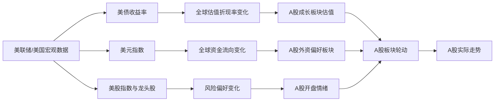
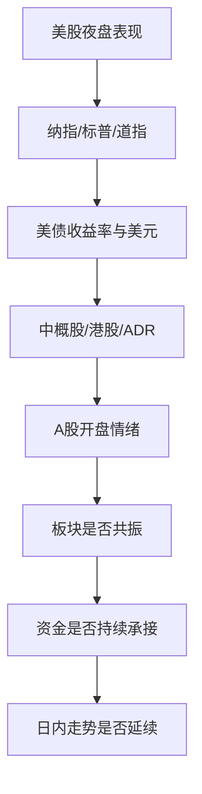

# 美股与A股关联细节全景解析

## 一、先说结论：美股与A股是什么关系

美股和A股不是“同涨同跌”的简单关系，但两者之间确实存在非常强的联动。对A股来说，美股更像是一个**全球风险偏好的前置观察窗口**：

- 美股先开盘、先交易、先消化海外宏观信息
- A股后开盘，往往会把美股夜间变化、全球资金情绪、美元和利率变化一起反映出来
- 但A股并不是完全跟随美股，国内政策、资金面、产业事件和板块轮动，往往会把这种影响重新“改写”

所以更准确的说法是：

**美股影响A股，但不是决定A股；美股提供方向线索，A股最终还是看自身环境落地。**

---

## 二、为什么美股会影响A股

### 1. 时间顺序决定了“信息先后”

A股每天开盘前，通常已经经历了美股一个完整交易日的变化。也就是说，很多全球性信息会先在美股市场完成定价，再传导到A股：

- 美联储讲话
- 美国CPI、PPI、就业数据
- 美债收益率变化
- 美股科技股财报
- 国际地缘冲突升级或缓和

A股开盘时，市场会直接参考这套“前一晚的全球答案”。

### 2. 美股是全球风险资产的重要风向标

美股尤其是纳斯达克，长期代表全球风险偏好。通常来说：

- 美股强，尤其科技股强，市场更愿意拥抱成长和高估值资产
- 美股弱，尤其是暴跌或高波动时，全球资金更容易转向防御

A股虽然结构不同，但成长板块、科技板块、题材股情绪，往往会受这种风险偏好影响。

### 3. 全球资金定价是联动的

全球资产并不是彼此隔离的。美元、利率、黄金、原油、美债、纳指、港股、A股，实际上构成了一个互相影响的系统。

尤其是：

- **美债收益率**会影响全球估值折现率
- **美元指数**会影响新兴市场资金流向
- **美股科技股**会影响全球科技链条估值
- **原油和大宗商品**会影响通胀预期和成本端

---

## 三、美股传导到A股的核心路径

### 路径一：情绪传导

这是最直接、最快速的路径。

当美股大涨时，A股开盘前市场情绪通常偏积极，尤其是：

- 高弹性题材股
- 科技成长股
- 机器人、AI、半导体、创新药等方向

当美股大跌时，A股往往先受到情绪压制，开盘阶段更容易低开，尤其是高位题材和高估值成长股。

### 路径二：利率传导

美国利率变化非常关键。因为估值不是只看业绩，还要看折现率。

- 美债收益率上行：成长股估值通常承压
- 美债收益率下行：成长股估值往往更容易修复

这会传导到A股的科技、医药、互联网、消费成长等板块。

### 路径三：汇率传导

美元强弱会影响全球资金分布。

- 美元走强：新兴市场资金可能承压，人民币资产情绪也可能变弱
- 美元走弱：风险偏好通常更容易抬升

A股中与外资偏好相关度较高的板块，往往会更明显地受到影响。

### 路径四：产业链传导

美股很多龙头公司对应全球产业链的上游或核心环节，它们的走势会影响A股相关产业链的预期。

例如：

- 美股半导体龙头上涨，A股半导体设备、材料、设计、封测可能跟涨
- 美股AI龙头强势，A股算力、服务器、液冷、光模块、存储等方向容易被带动
- 美股新能源汽车和电池链波动，也可能影响A股相关概念

### 路径五：港股与中概股中转传导

很多时候，美股对A股的影响不是直接来的，而是先体现在：

- 中概股
- 港股科技板块
- ADR（美国存托凭证）

这些资产通常比A股更早反映海外预期，再通过情绪和估值比较传导到A股。

---

## 四、最重要的几个观察变量

### 1. 纳斯达克指数

纳指对A股成长板块的影响最大，尤其是：

- AI
- 半导体
- 软件
- 通信设备
- 云计算
- 互联网科技

如果纳指连续走强，A股科技成长股通常更容易获得情绪支撑。

### 2. 标普500指数

标普更偏“整体风险资产”代表，适合观察全球风险偏好是否稳定。

- 标普稳步上涨：通常说明整体风险偏好较好
- 标普大幅回撤：常意味着全球资金开始谨慎

### 3. 道琼斯指数

道指更偏传统经济、价值板块。它对A股的影响通常不如纳指直接，但能帮助判断市场是否在做风格切换：

- 价值风格偏强：A股银行、煤炭、能源、红利风格可能更受关注
- 科技风格偏强：A股成长、题材、TMT更容易活跃

### 4. 美债收益率

这是非常重要的“隐形变量”。

- 10年期美债收益率上行，通常会压制高估值成长股
- 10年期美债收益率下行，通常利好成长和长久期资产

很多时候，A股科技板块的强弱，不是只看美股涨跌，而是看“美股涨的同时，美债收益率是上行还是下行”。

### 5. 美元指数

美元指数反映全球资金对美元资产的偏好。

- 美元强：风险资产压力增大
- 美元弱：风险资产通常更舒服

对A股来说，美元走强时，外资风险偏好可能下降，成长板块更容易承压。

### 6. VIX恐慌指数

VIX上升通常说明美股市场不安，全球风险偏好下降。A股次日往往更容易表现为：

- 低开
- 高位题材股回撤
- 防御板块相对占优

### 7. 原油、黄金、铜等大宗商品

大宗商品影响的不只是通胀，还影响行业利润和板块风格：

- 原油上行：化工、交通运输、航空、消费成本端受影响
- 黄金走强：通常反映避险情绪
- 铜等工业金属走强：有时反映全球需求预期改善

---

## 五、美股不同走势，对A股通常会怎样

### 1. 纳指大涨，科技龙头领涨

常见影响：

- A股科技成长板块情绪被点燃
- 半导体、AI、算力、光模块、软件、机器人容易被关注
- 开盘更容易出现高开或盘中脉冲

但要注意，如果A股自身处在弱势周期，往往只是“情绪高开”，不一定能持续。

### 2. 美股大跌，尤其是科技股重挫

常见影响：

- A股成长股承压
- 高位题材容易出现兑现
- 市场风格可能转向防御、红利、低估值

如果叠加美债收益率上行，A股科技板块压力会更明显。

### 3. 美股小幅震荡，但利率下行

这种情况对A股不一定差。

因为市场不只是看指数涨跌，还要看“估值环境”。
如果美股震荡但利率下行，A股成长板块有时反而能获得估值修复机会。

### 4. 美股价值股走强，科技股偏弱

这通常意味着市场风格在向防御或传统经济切换。

A股可能出现：

- 红利风格走强
- 银行、煤炭、电力、石油等方向相对抗跌
- 题材股热度下降

### 5. 美股暴跌，但A股低开高走

这种情况并不少见，原因通常有几类：

- A股前期已经提前消化利空
- 国内政策或流动性预期更强
- 市场本身处于独立主线行情
- A股资金风格与美股不一致

这说明美股影响很大，但并非每次都能压住A股。

---

## 六、A股和美股的行业映射关系

下面是最常见的联动方向。

| 美股方向 | A股可能对应板块 | 逻辑 |
|---|---|---|
| 纳斯达克科技龙头 | AI、算力、半导体、软件、通信设备 | 风险偏好与科技估值共振 |
| 美股半导体 | 半导体设备、材料、设计、封测 | 产业链联动最强之一 |
| 美股AI/云计算 | 服务器、光模块、液冷、数据中心 | 全球算力投资预期传导 |
| 美股新能源车 | 汽车零部件、电池、充电桩 | 技术和估值情绪联动 |
| 美股消费龙头 | 消费电子、家电、可选消费 | 需求预期与情绪映射 |
| 美股医药龙头 | 创新药、CXO、医疗器械 | 估值与管线预期影响 |
| 美股金融股 | 银行、券商、保险 | 更多反映风险偏好与宏观利率 |
| 美股能源股 | 石油、煤炭、化工、航运 | 大宗商品与通胀链条 |
| 美股黄金股 | 贵金属、避险资产 | 风险偏好下降时更常见 |

注意：

**映射不是一一对应，更不是机械跟涨。**
美股龙头涨了，A股相关板块未必立即涨；但如果板块本身也处在启动窗口，联动效果会更明显。

---

## 七、A股看美股，最该看什么，不该看什么

### 最该看

#### 1. 方向而不是点位

不要只盯着“美股涨了多少点”，更重要的是看：

- 是普涨还是结构性上涨
- 是科技强还是价值强
- 是趋势延续还是单日反弹
- 有没有伴随利率和美元变化

#### 2. 风格而不是单一指数

不同美股风格，对A股的指向不同：

- 纳指强：偏成长
- 道指强：偏价值
- 标普稳：偏整体风险偏好稳定

#### 3. 利率和美元

很多时候，真正决定A股风格的不是美股涨跌本身，而是背后的利率和汇率环境。

### 不该看

#### 1. 不能见到美股涨就直接追A股

A股有自己的节奏。前一晚美股大涨，不代表A股第二天一定高开高走。

#### 2. 不能只看单日涨跌

单日美股波动很可能只是消息扰动，必须结合连续几天的走势和趋势判断。

#### 3. 不能忽略国内因素

A股真正的驱动变量，往往还是：

- 国内政策
- 经济数据
- 产业趋势
- 资金流向
- 板块轮动

---

## 八、什么时候美股对A股影响最强

### 1. A股处于情绪敏感阶段

比如：

- 市场成交量偏低
- 题材股活跃度高
- 高位分歧明显
- 资金缺乏主线

这种时候，美股波动容易放大A股的开盘情绪。

### 2. A股主线与美股科技主线高度一致

比如 AI、半导体、算力、机器人，这些方向本身就具有强全球映射属性。

### 3. 海外数据和事件密集发布期

例如：

- 美联储议息会议
- 美国通胀数据
- 非农就业数据
- 大型科技公司财报

这种时候，美股的领先作用更明显。

### 4. 美债和美元出现明显趋势

一旦利率和美元形成明确方向，A股的成长/价值风格切换就更容易被触发。

---

## 九、典型联动场景拆解

### 场景1：美股科技股大涨，纳指出现突破

A股可能的表现：

- 开盘科技板块情绪较好
- 半导体、AI、算力、光模块有资金尝试
- 如果A股大盘不弱，容易形成共振

### 场景2：美股大跌，美元走强，美债收益率上行

A股可能的表现：

- 成长板块承压
- 高估值题材降温
- 防御板块相对占优

### 场景3：美股涨跌不大，但利率明显回落

A股可能的表现：

- 风险偏好改善
- 成长股估值修复预期增强
- 盘面可能先从高弹性板块试探

### 场景4：美股能源和原油走强

A股可能的表现：

- 化工、煤炭、油气、航运关注度提升
- 通胀预期抬升时，资源类板块相对活跃

---

## 十、日常看盘时怎么用这套关系

### 开盘前看四件事

1. 美股主要指数是涨还是跌
2. 纳指、标普、道指谁更强
3. 美债收益率和美元指数怎么走
4. 是否有重大事件影响情绪

### 开盘后看三件事

1. A股是否低开高走或高开低走
2. 资金是否真的去承接相关板块
3. 联动是短线情绪，还是能扩散成板块行情

### 盘中再判断一件事

**A股是在“跟随美股”，还是在“走自己的主线”。**

这是最重要的分水岭。

- 如果只是跟随，通常持续性有限
- 如果有国内主线叠加，行情会更扎实

---

## 十一、常见误区

### 误区1：美股涨，A股就一定涨

不对。A股有自己的流动性、政策和产业逻辑。

### 误区2：美股跌，A股就一定惨

也不对。A股有时会提前消化，或者被国内利好对冲。

### 误区3：只看美股指数，不看利率和美元

这是最常见的错误。很多时候，真正影响A股估值的是利率，不是单纯指数涨跌。

### 误区4：把所有行业都当成同一类资产

科技、金融、消费、资源、医药，对美股变化的敏感度完全不同。

### 误区5：只看一晚上的波动

美股到A股的传导更适合看趋势，不适合只看单日。

---

## 十二、最实用的总结口诀

可以记成下面这几句：

**看美股，先看纳指；看联动，先看利率；看情绪，再看美元；看A股，最后看自己。**

再简单一点就是：

**美股给方向，利率定估值，美元定风格，A股看落地。**

---

## 十三、案例图表结构建议

这一部分建议直接作为文档的“图表索引区”，方便你后续补图、补表，或者把它做成更完整的教程版式。

### 1. 总体传导关系图

### 2. 美股到A股的观察链条图

### 3. 案例场景对照表

| 案例场景 | 美股信号 | A股常见表现 | 重点观察 |
|---|---|---|---|
| 科技股共振上行 | 纳指走强，科技龙头领涨 | AI、半导体、算力、光模块活跃 | 是否放量、是否延续到午后 |
| 风险偏好下降 | 美股大跌，VIX上升 | 高位题材回撤，防御风格占优 | 是否出现低开高走修复 |
| 利率回落修复 | 美债收益率下行 | 成长板块估值修复预期增强 | 资金是否回流高估值方向 |
| 资源链走强 | 原油、铜等商品上涨 | 化工、煤炭、油气、航运活跃 | 逻辑是通胀还是供需改善 |
| 美股涨但A股弱 | 海外强、本土弱 | A股高开后回落或冲高受阻 | 国内资金是否接力 |

### 4. 建议插图位置

如果后面你要补成正式版，可以在以下位置插图：

- **图1：全球资产联动总览图** —— 放在“二、为什么美股会影响A股”后面
- **图2：美股传导到A股路径图** —— 放在“三、美股传导到A股的核心路径”后面
- **图3：行业映射关系图** —— 放在“六、A股和美股的行业映射关系”后面
- **图4：典型场景案例图** —— 放在“九、典型联动场景拆解”后面

### 5. 你可以后续继续补充的图形类型

- 关系图：用于说明美股、美债、美元、A股之间的逻辑链
- 对照表：用于整理不同美股信号对应的A股表现
- 时间轴图：用于展示美股夜盘到A股开盘的传导过程
- 板块热力图：用于展示A股行业映射关系

---

## 十四、最后的结论

美股与A股的关系，本质上是**全球资产定价体系中的前后联动**。

- 美股是前台，先交易、先反映、先定情绪
- A股是后场，接收外部信号后，再结合自身资金、政策和产业逻辑重新定价
- 真正决定A股表现的，从来不是“美股今天涨没涨”这一条，而是美股背后的**风险偏好、利率、美元、行业风格和全球资金流**

所以，看美股不是为了机械跟单，而是为了更早判断：

**全球资金现在是愿意冒险，还是开始防守。**

这才是美股与A股关联中最有价值的部分。
